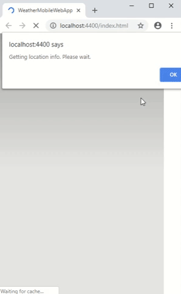
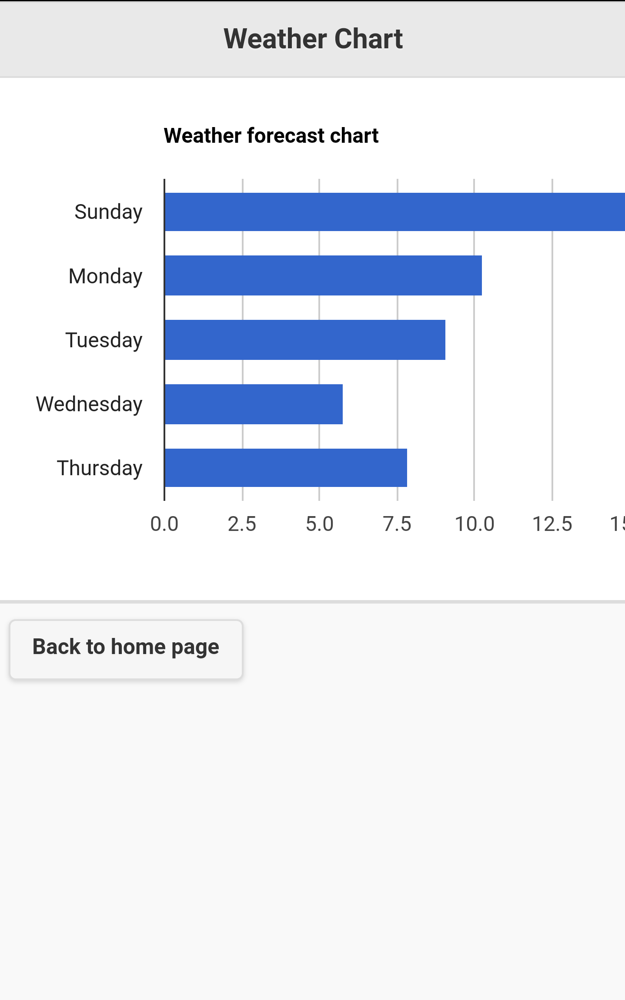

Weather App

A weather tracking hybrid mobile web application that gives the daily temperature forecast. Users can view temperature forecast for the next 5 days for their current location. 

Collaborated with a class colleague to develop a Weather app using knowledge from the course and outside sources
Developed business requirements documents (BRD), functional requirements, UI design, and testing plan
Learned to develop with Apache Cordova in 1 week, successfully implementing features like getting user location, retrieving 5-day weather forecast and storing weather information for offline usage
Planned development with a strong attention for course project requirement details, completing development in 3 weeks 

 

 

Technologies: Apache Cordova framework, Jquery mobile, AJAX, Open Weather Map APIs, IndexedDB  for client-side storage, Visual Studio IDE for development 
